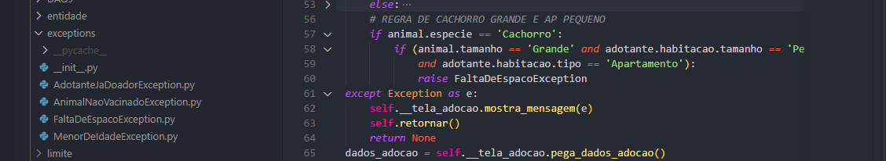
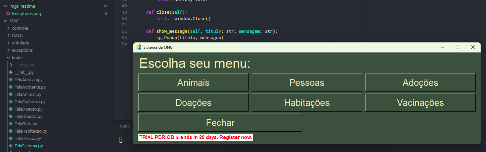

# Trabalho-DSOO1

Trabalho completo da disciplina INE5605-02238A (20242) - Desenvolvimento de Sistemas Orientados a Objetos I.
Este trabalho consiste em desenvolver um software utilizando o paradigma de Orientação a Objetos com a linguagem Python.
Devemos fazer um CRUD completo de tema livre ou seguindo um tema padrão. Este trabalho aqui segue o tema padrão proposto e disponível para leitura íntegra no [PDF](INE5605_Tema_Padrao_Trabalho_01_2024-2_v2.pdf).

## MVC
Para o padrão de projeto, foi adotado o MVC como visto nas aulas expositivas.
Na pasta [MVC](MVC/) temos as subpastas:

 - [Entidade](MVC/entidade/) (*Model*)
 - [Limite](MVC/limite/) (*View*)
 - [Controle](MVC/controle/) (*Control*)
 - [Exceptions](MVC/exceptions/): É a pasta que contém as classes relacionadas aos tratamentos de exceções. Cada item é uma herança da classe base `Exception` e está representando os erros previstos nas regras de negócio do tema padrão. 

# Persistência de dados e GUI
Foi a segunda parte do trabalho. Desenvolvi a parte de persistência de dados usando o módulo **pickle** do Python, enquanto as novas interfaces gráficas (agora saindo do terminal e passando para algo mais visual) foram feitas utilizando a biblioteca **PySimpleGUI** na sua versão *free trial*.
